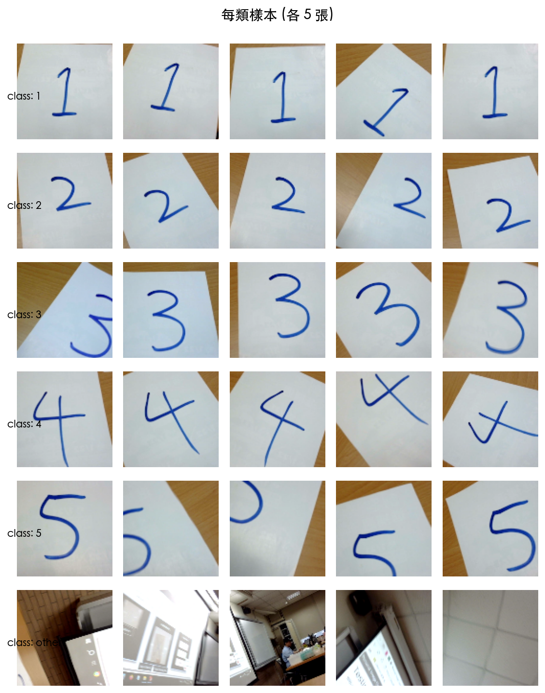
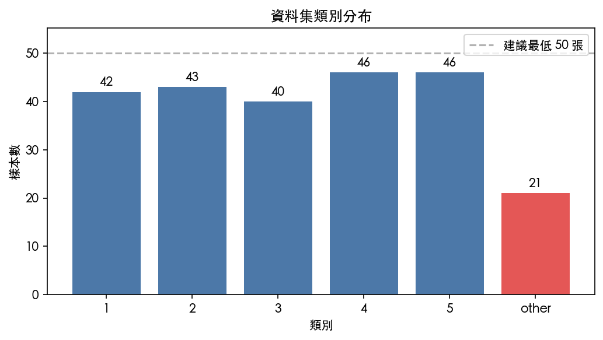

# 一、任務目標

本週以 **監督式學習** 為核心，使用 MIT App Inventor 提供之 **Personal
Image Classifier (PIC)** 工具，訓練一個可辨識手寫數字 1–5 的影像分類模
型，做為後續自駕車**視覺指令辨識**（數字紙卡當作行進指令）的原型。

模型將匯出 `.mdl` 檔，後續整合至 App Inventor 手機應用程式，並透過藍牙
連線至 ESP32 控制車體。

---

# 二、方法論

## 2.1 學習範式

採 **監督式學習（supervised learning）**：

```
輸入 (X)            標籤 (y)
車頭視角的手寫數字   "1" / "2" / ... / "5" / "other"
影像 (100×100 px)
```

## 2.2 模型架構

使用 **遷移學習（transfer learning）**，以 MobileNet 作為凍結的特徵萃
取器，在其上訓練客製化的分類頭。

| 項目 | 內容 |
|---|---|
| Backbone | `MobileNet v1 (width=0.25, input=224)` |
| 特徵擷取層 | `conv_pw_13_relu` |
| 分類頭 | 全連接層（由 PIC 自動建立） |
| 輸出類別數 | 6 |
| 模型大小 | 148 KB |
| 部署格式 | TensorFlow.js（`.mdl` 內含 4 檔案） |

## 2.3 訓練環境

PIC 工具完全執行於瀏覽器端，使用 TensorFlow.js + WebGL 於學生本機計算，
無資料上傳，符合隱私保護原則。

---

# 三、資料集

## 3.1 類別設計

| 類別 | 意義 | 預期車體動作 |
|---|---|---|
| `1` | 手寫數字 1 | （待定） |
| `2` | 手寫數字 2 | （待定） |
| `3` | 手寫數字 3 | （待定） |
| `4` | 手寫數字 4 | （待定） |
| `5` | 手寫數字 5 | （待定） |
| `other` | 無數字、其他畫面 | 維持原狀 |

## 3.2 樣本概覽

每類取 5 張訓練樣本如下圖：



## 3.3 類別數量分布

資料集共 **238 張**影像，6 個類別，各類樣本數如下：



**觀察**：

- 數字 1–5 各類介於 40–46 張，分布均勻。
- `other` 僅 21 張，**明顯少於其他類別**（低於建議最低 50 張）。
- 由於「非指令畫面」的視覺多樣性最大（地板、手、雜物、光影），實務上
  `other` 樣本應**多於**各指令類，此為後續需補強之處。

---

# 四、結果

目前模型已完成訓練並匯出為 `pic_digits_model_v2.mdl`，待與 App Inventor
整合後進行實機測試。模型檔案結構：

```
pic_digits_model_v2.mdl  (zip archive)
├── model.json              ← 網路拓撲
├── model.weights.bin       ← 權重 (148 KB)
├── model_labels.json       ← 標籤對應表
└── transfer_model.json     ← 指向 MobileNet base
```

---

# 五、限制與後續計畫

## 5.1 已知限制

1. **`other` 類別樣本不足**，實戰時可能對無數字畫面誤判為數字，造成
   車體誤觸發指令。
2. **光源與背景單一**：多數訓練影像為室內光線下的白紙背景，於不同場
   地的泛化能力未知。
3. **視角偏差**：目前拍攝高度接近人眼，與車頭鏡頭（約 5–10 cm）有
   差距，需補拍低視角樣本。

## 5.2 後續工作（Week 9 起）

| 項目 | 說明 |
|---|---|
| App Inventor 整合 | 匯入 PIC Extension，掛載 `.mdl`，驗證即時辨識 |
| 指令對應定義 | 每個數字對應之車體行為（前進、轉向、停止…） |
| 藍牙橋接 ESP32 | 依分類結果下達藍牙指令驅動馬達 |
| `other` 補樣本 | 補足 30–50 張多樣化的非指令畫面 |
| 實車測試 | 紙卡放置於車前，紀錄誤觸發率 |

---

# 六、附件

本 ODT 檔案內已嵌入下列附件（位於 `attachments/`）：

| 檔名 | 內容 |
|---|---|
| `pic_digits_dataset_v2.zip` | 238 張訓練資料（PIC 原始格式，可回匯 PIC 續訓） |
| `pic_digits_model_v2.mdl` | 已訓練之模型檔（可匯入 App Inventor PIC Extension） |

## 6.1 附件取用方式

ODT 檔案在底層為 ZIP 壓縮檔，可用以下任一方式取出附件：

**方式 A：終端機**
```bash
unzip -j "week08_成果報告.odt" "attachments/*" -d ./attached/
```

**方式 B：檔案管理員**
將檔名 `week08_成果報告.odt` 複製一份並改名為 `.zip`，雙擊解壓後進入
`attachments/` 資料夾取出。

**方式 C（macOS）**：使用 The Unarchiver 直接拖放 `.odt` 解壓。

上述操作**不會**影響原 ODT 的閱讀與編輯。
